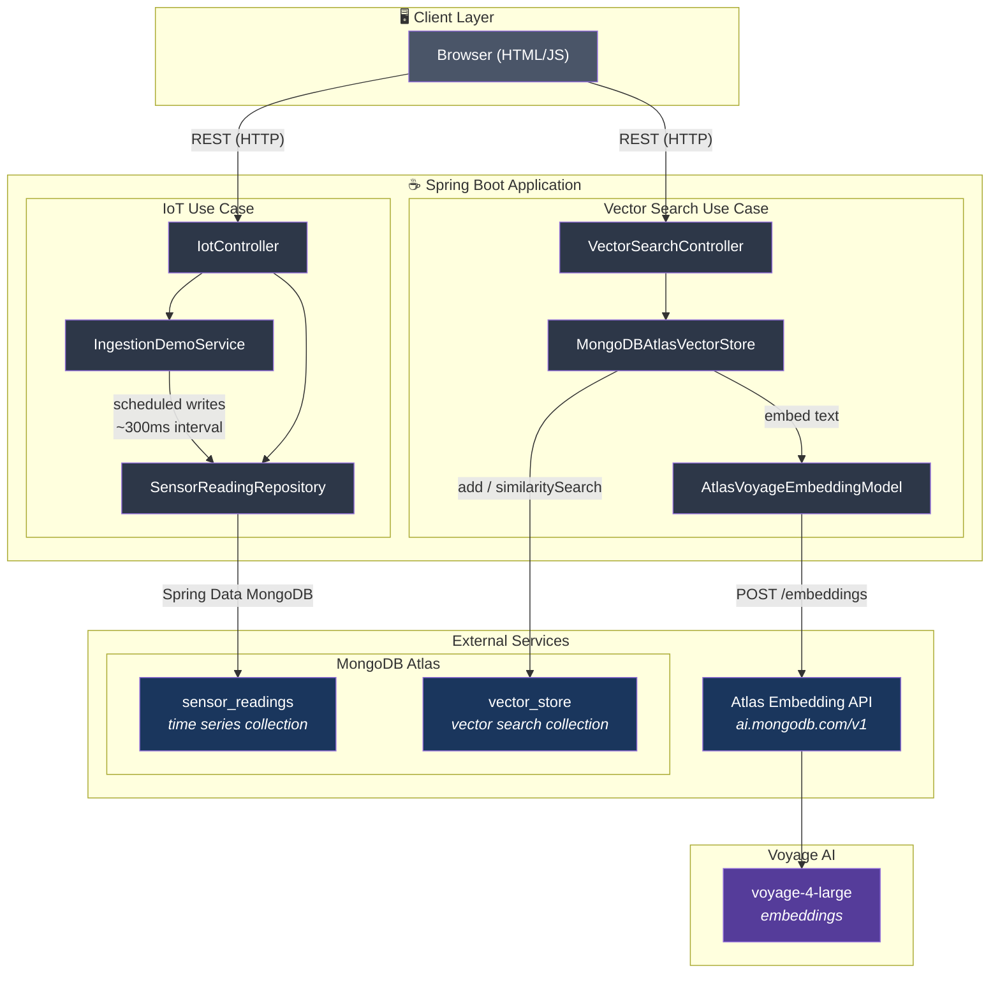

# Spring Vector Boilerplate – Architecture

## Overview Diagram



## Communication & Event Flows

```mermaid
sequenceDiagram
    autonumber
    participant U as User / Browser
    participant IC as IotController
    participant ID as IngestionDemoService
    participant Repo as SensorReadingRepository
    participant VC as VectorSearchController
    participant VS as VectorStore
    participant EM as AtlasVoyageEmbeddingModel
    participant Atlas as Atlas Embedding API
    participant Mongo as MongoDB Atlas

    rect rgb(45, 55, 72)
        Note over U,Mongo: IoT – Ingestion Demo
        U->>IC: POST /api/iot/readings/ingest-demo
        IC->>ID: startIngestion()
        IC-->>U: 202 Accepted
        loop Every ~300ms for 5 min
            ID->>Repo: save(SensorReading)
            Repo->>Mongo: insert sensor_readings
        end
    end

    rect rgb(45, 55, 72)
        Note over U,Mongo: IoT – Live Dashboard (polling)
        loop Every 1 second
            U->>IC: GET /api/iot/latest-readings?limit=10
            IC->>Mongo: aggregation (sort + limit)
            Mongo-->>IC: latest readings
            IC-->>U: JSON array
        end
    end

    rect rgb(45, 55, 72)
        Note over U,Mongo: Vector – Add Documents
        U->>VC: POST /api/vector/add (documents)
        VC->>VS: add(documents)
        VS->>EM: embed(text) for each doc
        EM->>Atlas: POST /embeddings (Voyage AI)
        Atlas-->>EM: vectors
        EM-->>VS: embeddings
        VS->>Mongo: insert vector_store
        VC-->>U: 200 OK
    end

    rect rgb(45, 55, 72)
        Note over U,Mongo: Vector – Semantic Search
        U->>VC: GET /api/vector/search?query=...&topK=5
        VC->>VS: similaritySearch(query, topK)
        VS->>EM: embed(query)
        EM->>Atlas: POST /embeddings
        Atlas-->>EM: query vector
        EM-->>VS: query embedding
        VS->>Mongo: $vectorSearch (cosine similarity)
        Mongo-->>VS: ranked documents + scores
        VS-->>VC: List&lt;Document&gt;
        VC-->>U: JSON results
    end
```

## Technology Stack

| Layer | Component | Technology |
|-------|-----------|------------|
| **Client** | Browser UI | HTML, CSS, JavaScript (vanilla) |
| **API** | REST endpoints | Spring Web MVC |
| **IoT** | Time series data | Spring Data MongoDB, MongoDB time series collection |
| **Vector** | Embeddings | Spring AI, Atlas Embedding API, Voyage AI (voyage-4-large) |
| **Vector** | Storage & search | MongoDB Atlas Vector Search (HNSW, cosine similarity) |
| **Database** | Persistence | MongoDB Atlas |
| **Scheduling** | Ingestion demo | `ScheduledExecutorService` |

## Data Flow Summary

| Use Case | Trigger | Process | Storage |
|----------|---------|---------|---------|
| **IoT Ingestion** | User clicks "Start 5-minute ingestion" | 1000 readings scheduled over 5 min (~300ms each) | `sensor_readings` (time series) |
| **IoT Live Feed** | User clicks "Start live feed" | Browser polls `/latest-readings` every 1s | Read from `sensor_readings` |
| **IoT Query** | User submits device query | Query by deviceId + optional time range | Read from `sensor_readings` |
| **Vector Add** | User selects articles or adds custom text | Text → embeddings (Atlas API) → store | `vector_store` collection |
| **Vector Search (semantic)** | User submits search query | Query → embedding → $vectorSearch → ranked results | Read from `vector_store` |
| **Vector Search (hybrid)** | User submits search, mode=hybrid | Vector search + text search → RRF fusion → combined results | Read from `vector_store` (text index on `content`) |
